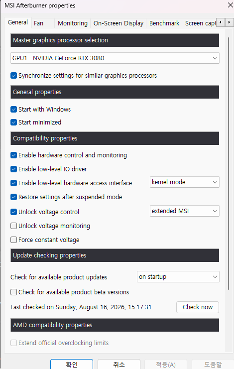
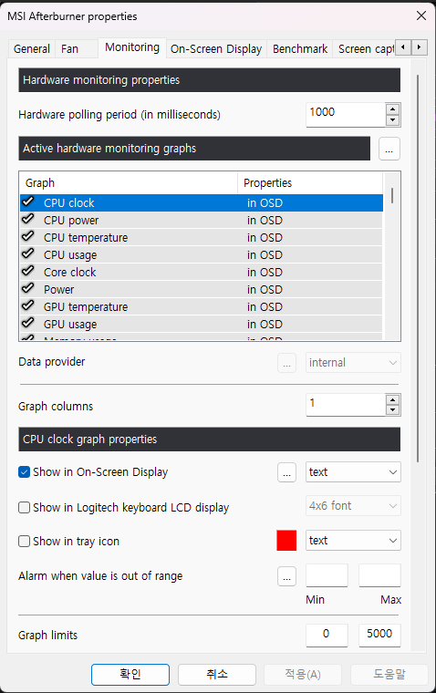

# 🌍 Save Earth (Rust Edition) v2.0.0

> **"한 번의 깜빡임을 참는 것으로 지구와 전기요금을 함께 구할 수 있습니다."**  
> 고성능 PC 환경에서 누수되는 전력을 자동으로 관리해 주는 경량 네이티브 전력 절감 어플리케이션입니다.

## ⚠️ 사용 전 확인 사항 (Prerequisites)

앱을 원활하게 구동하기 위해 아래의 항목을 반드시 확인해 주세요.

1. **엔비디아(NVIDIA) 그래픽 카드** 환경인가요?
2. **MSI Afterburner**가 설치되어 있나요?
3. 애프터버너 **설정 - General(일반) 탭**이 아래와 같이 설정되어 있나요?
   * **General 탭 주요 설정:** `Enable hardware control and monitoring`, `Enable low-level IO driver`,   
   `Enable low-level hardware access interface` 체크 확인
   <br>

   * 
   <br>
   <br>


4. 애프터버너 **설정 - Monitoring(모니터링) 탭**에서 필요한 센서 항목들에 **체크(v)**가 되어 있나요?

   * 


## ✨ 주요 기능 (Key Features)

* **🖥️ 스마트 듀얼 모니터 자동 절전**
  * 단 한 번의 화면 전환만으로 전력을 효율적으로 절감합니다.
  * 주 모니터에서 게임을 실행하거나 영상을 전체화면으로 시청할 때, 사용하지 않는 보조 모니터의 출력을 자동으로 차단하여 절전 모드로 전환합니다.
  * 전체화면 종료 시 **DDC/CI 신호**를 통해 보조 모니터를 즉시 복원하며 기존 창 위치까지 원상복구합니다[cite: 4].
  * 모니터가 DDC/CI 1번 명령을 수신할 수 있는 환경이라면 꺼진 상태에서도 자동으로 켜질 수 있으며, 켜진 뒤 원래의 모니터 배치로 완벽하게 복원됩니다[cite: 4].
  * 캡처 도구(`Win+Shift+S`, `PrtScn`) 실행 시 오동작하지 않도록 5초 유예 타이머 및 프로세스 예외 처리가 적용되어 있습니다[cite: 3].

* **⚡ 실시간 윈도우 전원 옵션 제어**
  * 시스템 부하 상태를 실시간으로 감지하여 전원 모드를 자동 변경합니다.
  * **게임 / 고부하 작업:** 최고 성능 모드 (`Ultimate`)
  * **웹서핑 / 영상 시청 / 유휴 상태:** 균형 모드 (`Balanced`)
  * 항상 최고 성능을 유지할 때 대비 균형 모드 전환을 통해 **약 12%의 전력 절감 효과**를 제공합니다.

* **📊 MSI Afterburner 센서 정밀 연동 및 범용 모듈**
  * **MSI Afterburner (v4.6.6 정식 버전 권장)**의 하드웨어 센서 데이터를 실시간 공유 메모리(파이프)를 통해 수집하여 시스템 자원을 가장 정밀하게 감지합니다.
  * 애프터버너 센서 값을 가져오는 모듈은 **범용적으로 설계**되어 있어, 다른 애플리케이션에서도 함수처럼 간단하게 가져다 쓸 수 있습니다[cite: 5].
  * **사용법 예시:**
    ```rust
    // 다른 Rust 앱에서 모듈을 임포트하여 함수처럼 사용
    if let Some(sensors) = afterburner::SystemSensors::fetch_tick() {
        let cpu_temp = sensors.cpu_temp();
        let gpu_usage = sensors.gpu_usage();
    }
    ```

* **🚀 극상의 초경량 네이티브 스펙**
  * **Rust + egui + Win32 API** 조합으로 제작되어 백그라운드 상주 메모리 
   단 **1.4MB**, 실행 파일 단일 **~7.3MB**의 압도적인 최적화를 자랑합니다.

---

---

## 🧩 모듈별 기능 및 구현 핵심 로직 (Modules & Core Logic)

Save Earth (Rust Edition)은 철저한 역할 분리와 자원 최적화를 위해 여러 개의 독립된 모듈로 설계되었습니다.

### 1. `main.rs` (엔트리포인트 및 프로세스 분리)

* **기능**: 프로그램의 진입점으로, 관리자 권한 확인 및 백그라운드 트레이 모드와 대시보드 GUI 모드를 동적으로 분기합니다.
* **구현 핵심 로직**:
* `--dashboard` 인자 유무에 따라 트레이 프로세스와 GUI 프로세스를 완전히 분리하여 평상시 1MB 미만의 초경량 메모리를 유지합니다.
* Windows API `SetProcessWorkingSetSize`를 주기적으로 호출하여 백그라운드 대기 상태에서 사용하지 않는 힙 메모리 페이지를 운영체제로 즉시 반납(Trimming)합니다.


### 2. `tray.rs` (시스템 트레이 및 백그라운드 통신)

* **기능**: 윈도우 시스템 트레이 아이콘 관리, 실시간 툴팁 갱신, 그리고 대시보드 창 호출을 담당합니다.
* **구현 핵심 로직**:
* `tray-icon` 크레이트를 활용해 커스텀 아이콘 및 메뉴를 구성하고 1초 디바운스를 적용하여 중복 실행을 방지합니다.
* `Named Pipe` 서버를 통해 백그라운드 모니터링 데이터와 대시보드 GUI를 연결하며, 파일 수정 시각(`mtime`) 캐싱 기법을 적용해 불필요한 디스크 I/O를 원천 차단합니다.


### 3. `monitor.rs` & `afterburner.rs` (하드웨어 센서 연동)

* **기능**: CPU 및 GPU의 사용량, 전력 소모량, 온도 등을 실시간으로 수집합니다.
* **구현 핵심 로직**:
* Windows API 및 NVIDIA NVML 래퍼를 활용하며, MSI Afterburner 공유 메모리와 연동하여 가장 정밀한 하드웨어 데이터를 가져옵니다.
* 센서 수집 모듈이 범용 함수 구조로 분리되어 있어, 다른 Rust 프로젝트에서도 `SystemSensors::fetch_tick()` 형태로 가볍게 임포트하여 활용할 수 있습니다.


### 4. `moncon.rs` (스마트 듀얼 모니터 제어 및 예외 처리)

* **기능**: 주 모니터의 전체화면 진입/종료를 감지하여 보조 모니터를 제어하고 원래의 윈도우 배치로 복원합니다.
* **구현 핵심 로직**:
* Win32 Event Hook (`SetWinEventHook`)을 이용해 포커스 변경 및 창 상태/위치 변화를 0ms 지연으로 실시간 감지합니다.
* **2단계 극초경량 전체화면 판별**: 1단계로 창 크기와 모니터 크기가 일치하는지 먼저 검사한 뒤 일치할 때만 2단계로 캡처 도구(`Snipping Tool`, `Lightshot` 등) 예외 여부를 확인하여 CPU 부하와 프레임 드랍을 완벽히 방어합니다.
* **보조 모니터 전체화면 예외 처리**: 주 모니터가 전체화면이더라도 보조 모니터에서 동영상이나 게임 등이 전체화면으로 동작 중일 때는 모니터 출력이 꺼지지 않도록 안전장치를 제공합니다.
### 💡 `moncon.rs` 다른 앱에서의 사용 예시 (Usage Example)

`moncon.rs` 모듈을 다른 Rust 프로젝트에 독립적으로 적용하려면, 아래와 같이 백그라운드 매니저를 초기화하고 윈도우 메시지 루프를 구동하면 됩니다.

```rust
mod moncon;

fn main() {
    let manager = match moncon::MonconManager::init() {
        Ok(m) => {
            println!("모니터 제어 시스템이 정상적으로 시작되었습니다.");
            m
        }
        Err(e) => {
            eprintln!("모니터 제어 초기화 실패: {}", e);
            return;
        }
    };

    // (참고) 필요 시 강제 듀얼 복원 호출 가능: moncon::force_restore_dual_monitor();
    
    // 윈도우 이벤트 후킹을 위한 메시지 루프 실행 (블로킹 상태로 동작)
    manager.run_message_loop();
}
```


### 5. `power.rs` & `eco.rs` (전력 옵션 및 환경 지표 계산)

* **기능**: 윈도우 전원 모드(`Balanced` / `Ultimate`)를 실시간 제어하고 누적 전력 절감량과 탄소 감축 효과를 산출합니다.
* **구현 핵심 로직**:
* 임계값(Threshold)과 홀드 타임(Hold Time) 알고리즘을 적용하여 빈번한 전원 모드 변경으로 인한 시스템 스터터링(Stuttering)을 방지합니다.
* 한국전력 주택용/일반용 단가 기준 환산 로직 및 소나무 식재 효과 환산 공식을 탑재하여 친환경 기여도를 시각적으로 제공합니다.

## 💻 테스트 및 지원 환경 (Tested Environment)

* **OS:** Windows 11 Pro 64-bit (Build 22631)
* **CPU:** AMD Ryzen 7 5800X 8-Core Processor
* **RAM:** 32GB RAM
* **GPU:** NVIDIA GeForce RTX 3080
* **Monitors:**
  * 주 모니터: LG 27GN750BB (DisplayPort, 1920x1080 @ 240Hz, DDC/CI 1,4 ONLY)
  * 보조 모니터: LG TV (HDMI, 1366x768 @ 59Hz, Non DDC/CI)

---

## 🛠️ 빌드 및 실행 (Build & Run)

```bash
# 저장소 클론
git clone [https://github.com/yklee1008/save_earth_rust.git](https://github.com/yklee1008/save_earth_rust.git)
cd save_earth_rust

# 프로젝트 빌드 및 실행
cargo run --release
```

⚙️ Tech Stack & Dependencies
   * Language: Rust (2021 edition)

   * GUI Framework: egui / eframe

   * OS API: Win32 API (windows-rs v0.58, winapi)

   * Hardware Interop: MSI Afterburner Shared Memory Pipe